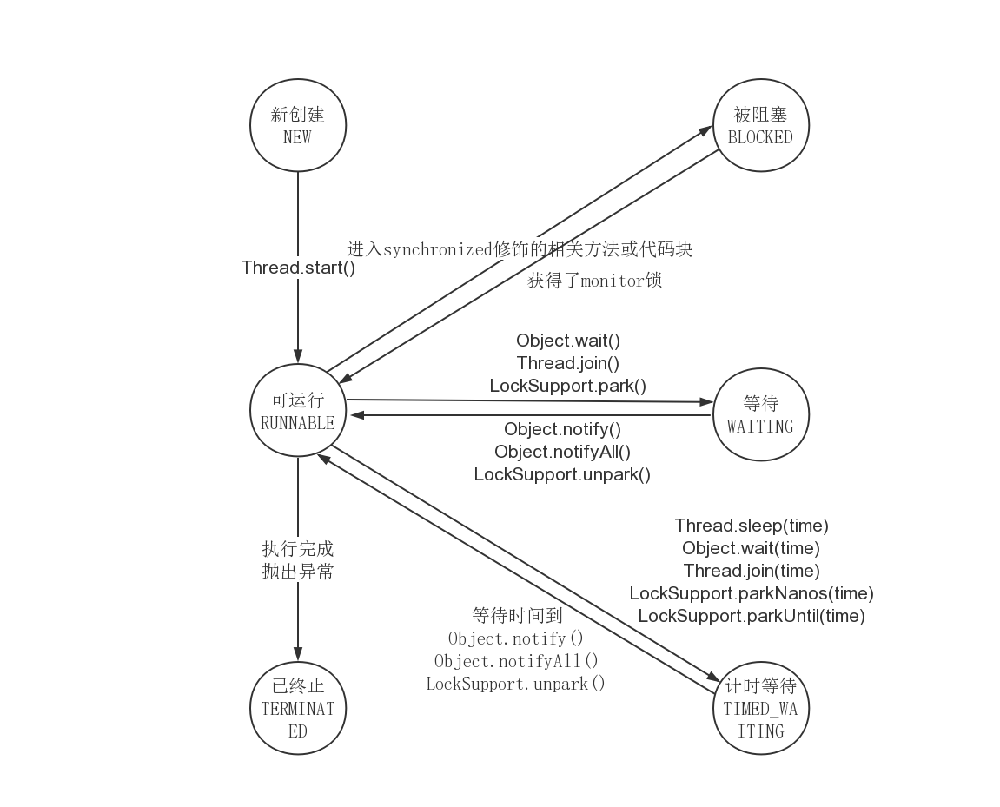

# 有哪6种状态

## New

创建但是没有启动的线程

## Runnable

- 启动了线程
- 对应着操作系统中的两种状态
	- ready
	- running
-  意思是可运行的，可能在运行，可能在等待CPU分配使用时间

## Blocked

- 进入synchronized对应的方法和代码块，并且monitor被其他的线程拿走了

## Waiting

## Timed Waiting

## Terminated

# 状态间的转化图示



## 代码演示

```java
package threadcoreknowledge.sixstates;

/**
 * 描述：     展示线程的NEW、RUNNABLE、Terminated状态。即使是正在运行，也是Runnable状态，而不是Running。
 */
public class NewRunnableTerminated implements Runnable {

    public static void main(String[] args) {
        Thread thread = new Thread(new NewRunnableTerminated());
        //打印出NEW的状态
        System.out.println(thread.getState());
        thread.start();
        System.out.println(thread.getState());
        try {
            Thread.sleep(10);
        } catch (InterruptedException e) {
            e.printStackTrace();
        }
        //打印出RUNNABLE的状态，即使是正在运行，也是RUNNABLE，而不是RUNNING
        System.out.println(thread.getState());
        try {
            Thread.sleep(100);
        } catch (InterruptedException e) {
            e.printStackTrace();
        }
        //打印出TERMINATED状态
        System.out.println(thread.getState());
    }

    @Override
    public void run() {
        for (int i = 0; i < 1000; i++) {
            System.out.println(i);
        }
    }
}

```

```java
package threadcoreknowledge.sixstates;

/**
 * 描述：     展示Blocked, Waiting, TimedWaiting
 */
public class BlockedWaitingTimedWaiting implements Runnable{
    public static void main(String[] args) {
        BlockedWaitingTimedWaiting runnable = new BlockedWaitingTimedWaiting();
        Thread thread1 = new Thread(runnable);
        thread1.start();
        Thread thread2 = new Thread(runnable);
        thread2.start();
        try {
            Thread.sleep(5);
        } catch (InterruptedException e) {
            e.printStackTrace();
        }
        //打印出Timed_Waiting状态，因为正在执行Thread.sleep(1000);
        System.out.println(thread1.getState());
        //打印出BLOCKED状态，因为thread2想拿得到sync()的锁却拿不到
        System.out.println(thread2.getState());
        try {
            Thread.sleep(1300);
        } catch (InterruptedException e) {
            e.printStackTrace();
        }
        //打印出WAITING状态，因为执行了wait()
        System.out.println(thread1.getState());

    }

    @Override
    public void run() {
        syn();
    }

    private synchronized void syn() {
        try {
            Thread.sleep(1000);
            wait();
        } catch (InterruptedException e) {
            e.printStackTrace();
        }
    }
}

```

# 阻塞状态是什么


# 常见面试问题

