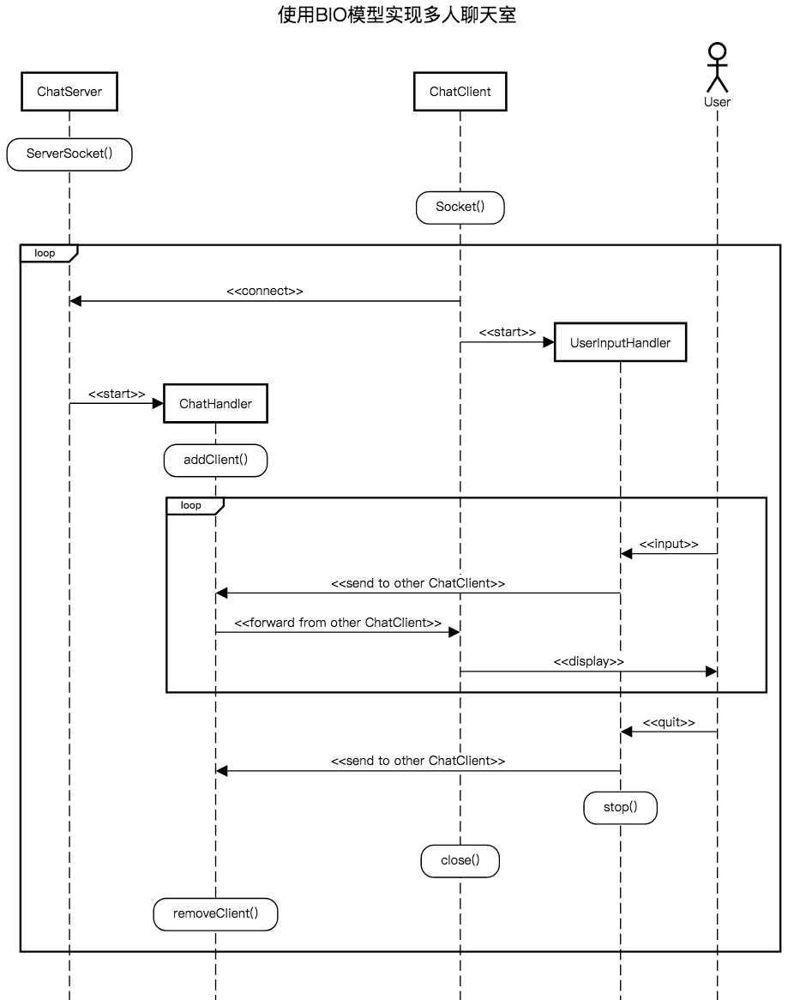

# Socket 和 ServerSocket


## 代码

## ServerSocket

```java
public class Server {
    public static void main(String[] args) {

        final String QUIT = "quit";
        final int DEFAULT_PORT = 8888;
        ServerSocket serverSocket = null;

        try {
            // 绑定监听端口
            serverSocket = new ServerSocket(DEFAULT_PORT);
            System.out.println("启动服务器，监听端口" + DEFAULT_PORT);

            while (true) {
                // 等待客户端连接，阻塞式
                Socket socket = serverSocket.accept();
                System.out.println("客户端[" + socket.getPort() + "]已连接");
                BufferedReader reader = new BufferedReader(
                        new InputStreamReader(socket.getInputStream())
                );
                BufferedWriter writer = new BufferedWriter(
                        new OutputStreamWriter(socket.getOutputStream())
                );

                String msg = null;
                while ((msg = reader.readLine()) != null) {
                    // 读取客户端发送的消息
                    System.out.println("客户端[" + socket.getPort() + "]: " + msg);

                    // 回复客户发送的消息
                    writer.write("服务器: " + msg + "\n");
                    writer.flush();

                    // 查看客户端是否退出
                    if (QUIT.equals(msg)) {
                        System.out.println("客户端[" + socket.getPort() + "]已断开连接");
                        break;
                    }
                }
            }
        } catch (IOException e) {
            e.printStackTrace();
        } finally {
            if (serverSocket != null) {
                try {
                    serverSocket.close();
                    System.out.println("关闭serverSocket");
                } catch (IOException e) {
                    e.printStackTrace();
                }
            }
        }

    }
}

```

## Socket

```java
public class Client {
    public static void main(String[] args) {

        final String QUIT = "quit";
        final String DEFAULT_SERVER_HOST = "127.0.0.1";
        final int DEFAULT_SERVER_PORT = 8888;
        Socket socket = null;
        BufferedWriter writer = null;

        try {
            // 创建socket
            socket = new Socket(DEFAULT_SERVER_HOST, DEFAULT_SERVER_PORT);

            // 创建IO流
            BufferedReader reader = new BufferedReader(
                    new InputStreamReader(socket.getInputStream())
            );
            writer = new BufferedWriter(
                    new OutputStreamWriter(socket.getOutputStream())
            );

            // 等待用户输入信息
            BufferedReader consoleReader =
                    new BufferedReader(new InputStreamReader(System.in));
            while (true) {
                String input = consoleReader.readLine();

                // 发送消息给服务器
                writer.write(input + "\n");
                writer.flush();

                // 读取服务器返回的消息
                String msg = reader.readLine();
                System.out.println(msg);

                // 查看用户是否退出
                if (QUIT.equals(input)) {
                    break;
                }
            }

        } catch (IOException e) {
            e.printStackTrace();
        } finally {
            if (writer != null) {
                try {
                    writer.close();
                    System.out.println("关闭socket");
                } catch (IOException e) {
                    e.printStackTrace();
                }
            }
        }

    }
}
```

# BIO 编程模型


# 多人聊天室

## 时序图



## Client 端

```java
public class ChatClient {

    private final String DEFAULT_SERVER_HOST = "127.0.0.1";
    private final int DEFAULT_SERVER_PORT = 8888;
    private final String QUIT = "quit";

    private Socket socket;
    private BufferedReader reader;
    private BufferedWriter writer;

    // 发送消息给服务器
    public void send(String msg) throws IOException {
        if (!socket.isOutputShutdown()) {
            writer.write(msg + "\n");
            writer.flush();
        }
    }

    // 从服务器接收消息
    public String receive() throws IOException {
        String msg = null;
        if (!socket.isInputShutdown()) {
            msg = reader.readLine();
        }
        return msg;
    }

    // 检查用户是否准备退出
    public boolean readyToQuit(String msg) {
        return QUIT.equals(msg);
    }

    public void close() {
        if (writer != null) {
            try {
                System.out.println("关闭socket");
                writer.close();
            } catch (IOException e) {
                e.printStackTrace();
            }
        }
    }

    public void start() {

        try {
            // 创建socket
            socket = new Socket(DEFAULT_SERVER_HOST, DEFAULT_SERVER_PORT);

            // 创建IO流
            reader = new BufferedReader(
                    new InputStreamReader(socket.getInputStream())
            );
            writer = new BufferedWriter(
                    new OutputStreamWriter(socket.getOutputStream())
            );

            // 处理用户的输入
            new Thread(new UserInputHandler(this)).start();

            // 读取服务器转发的消息
            String msg = null;
            while ((msg = receive()) != null) {
                System.out.println(msg);
            }
        } catch (IOException e) {
            e.printStackTrace();
        } finally {
            close();
        }
    }

    public static void main(String[] args) {
        ChatClient chatClient = new ChatClient();
        chatClient.start();
    }
}
```

```java
public class UserInputHandler implements Runnable {

    private ChatClient chatClient;

    public UserInputHandler(ChatClient chatClient) {
        this.chatClient = chatClient;
    }

    @Override
    public void run() {
        try {
            // 等待用户输入消息
            BufferedReader consoleReader =
                    new BufferedReader(new InputStreamReader(System.in));
            while (true) {
                String input = consoleReader.readLine();

                // 向服务器发送消息
                chatClient.send(input);

                // 检查用户是否准备退出
                if (chatClient.readyToQuit(input)) {
                    break;
                }
            }
        } catch (IOException e) {
            e.printStackTrace();
        }
    }
}
```

## Server 端

```java
public class ChatServer {

    private int DEFAULT_PORT = 8888;
    private final String QUIT = "quit";

    private ServerSocket serverSocket;
    private Map<Integer, Writer> connectedClients;

    public ChatServer() {
        connectedClients = new HashMap<>();
    }

    public synchronized void addClient(Socket socket) throws IOException {
        if (socket != null) {
            int port = socket.getPort();
            BufferedWriter writer = new BufferedWriter(
                    new OutputStreamWriter(socket.getOutputStream())
            );
            connectedClients.put(port, writer);
            System.out.println("客户端[" + port + "]已连接到服务器");
        }
    }

    public synchronized void removeClient(Socket socket) throws IOException {
        if (socket != null) {
            int port = socket.getPort();
            if (connectedClients.containsKey(port)) {
                connectedClients.get(port).close();
            }
            connectedClients.remove(port);
            System.out.println("客户端[" + port + "]已断开连接");
        }
    }

    public synchronized void forwardMessage(Socket socket, String fwdMsg) throws IOException {
        for (Integer id : connectedClients.keySet()) {
            if (!id.equals(socket.getPort())) {
                Writer writer = connectedClients.get(id);
                writer.write(fwdMsg);
                writer.flush();
            }
        }
    }

    public boolean readyToQuit(String msg) {
        return QUIT.equals(msg);
    }

    public synchronized void close() {
        if (serverSocket != null) {
            try {
                serverSocket.close();
                System.out.println("关闭serverSocket");
            } catch (IOException e) {
                e.printStackTrace();
            }
        }
    }

    public void start() {

        try {
            // 绑定监听端口
            serverSocket = new ServerSocket(DEFAULT_PORT);
            System.out.println("启动服务器，监听端口：" + DEFAULT_PORT + "...");

            while (true) {
                // 等待客户端连接
                Socket socket = serverSocket.accept();
                // 创建ChatHandler线程
                new Thread(new ChatHandler(this, socket)).start();
            }

        } catch (IOException e) {
            e.printStackTrace();
        } finally {
            close();
        }
    }

    public static void main(String[] args) {
        ChatServer server = new ChatServer();
        server.start();
    }

}
```

```java
public class ChatHandler implements Runnable {

    private ChatServer server;
    private Socket socket;

    public ChatHandler(ChatServer server, Socket socket) {
        this.server = server;
        this.socket = socket;
    }

    @Override
    public void run() {
        try {
            // 存储新上线用户
            server.addClient(socket);

            // 读取用户发送的消息
            BufferedReader reader = new BufferedReader(
                    new InputStreamReader(socket.getInputStream())
            );

            String msg = null;
            while ((msg = reader.readLine()) != null) {
                String fwdMsg = "客户端[" + socket.getPort() + "]: " + msg + "\n";
                System.out.print(fwdMsg);

                // 将消息转发给聊天室里在线的其他用户
                server.forwardMessage(socket, fwdMsg);

                // 检查用户是否准备退出
                if (server.readyToQuit(msg)) {
                    break;
                }
            }
        } catch (IOException e) {
            e.printStackTrace();
        } finally {
            try {
                server.removeClient(socket);
            } catch (IOException e) {
                e.printStackTrace();
            }
        }
    }
}
```