# HTTP

- HTTP（Hyper Text Transfer Protocol），译为超文本传输的协议
	- 是互联网中应用最广泛的应用层协议之一
	- 设计 HTTP 最初的目的是：提供一种发布和接收 HTML 页面的方法，由 URI 来识别具体的标识
	- 后面用 HTTP 来传递的数据格式不仅仅是 HTML，应用非常广泛
- HTML（Hyper Text Markup Language）：超文本标记语言
	- 用于编写网页

# 版本

- 1991年，HTTP/0.9
	- 只支持 GET 请求方法获取文本数据（比如 HTML 文档），而且不支持请求头，响应头等，无法向服务器传递太多数据

- 1996年，HTTP/1.0
	- 支持 POST、HEAD 等请求方法，支持请求头，响应头等，支持更多种数据类型（不再局限于文本数据）
	- 浏览器的每次请求都要与服务器建立一个 TCP 连接，请求处理完成后立即断开 TCP 连接

- 1997年，HTTP/1.1
	- 支持 PUT、DELETE 等请求方法
	- 采用持久连接（Connection：keep-alive），多个请求可以共用同一个 TCP 连接

- 2015年，HTTP/2.0

- 2018年，HTTP/3.0

# 标准

- HTTP 的标准
	- 由万维网协会（W3C）、互联网工程任务组（IETF）协调制定，最终发布了一系列的 RFC
- RFC（Request For Comments，可以译为：意见请求稿）
	- HTTP/1.1 最早是在 1997 年的 RFC 2068 中记录的
		- 该规范于 1999 年的 RFC 2616 中已作废
		- 2014年又由 RFC 7230 系列的 RFC 取代
	-  HTTP/2 标准于 2015 年 5 月以 RFC 7540 正式发表，取代 HTTP/1.1成为 HTTP 的实现标准
- 中国的 RFC
	- 1996 年 3 月，清华大学提交的适应不同国家和地区中文编码的汉字统一传输标准被 IETF 通过为 RFC 1922 
	- 成为中国大陆第一个被认可为RFC文件的提交协议

# ANBF

- ABNF（Augmented BNF）
	- 是 BNF（Backus-Naur Form，译为：巴科斯-瑙尔范式)的修改、增强版
	- 在 RFC 5234 中表明：ABNF 用作 internet 中通信协议的定义语言
	- ABNF 是最严谨的 HTTP 报文格式描述形式，脱离 ABNF 讨论 HTTP 报文格式，往往都是片面的，不严谨的
- 关于HTTP报文格式的定义
	- RFC 2616 4.HTTP Message(旧)
	- RFC 7230 3.Message Format (新)

## 核心规则

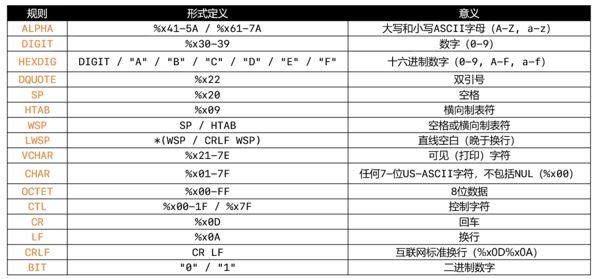

# 报文格式

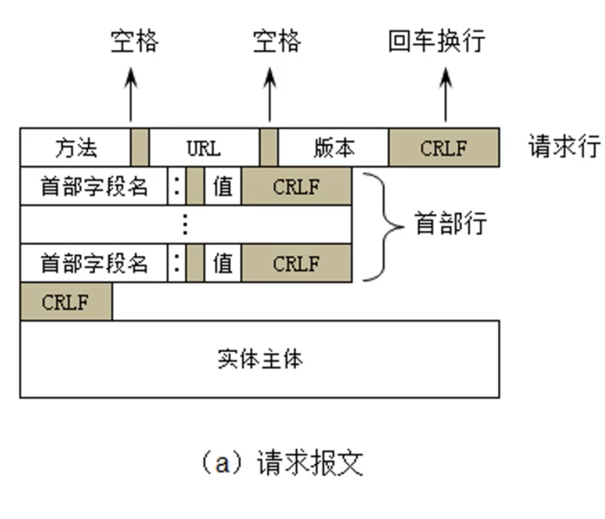

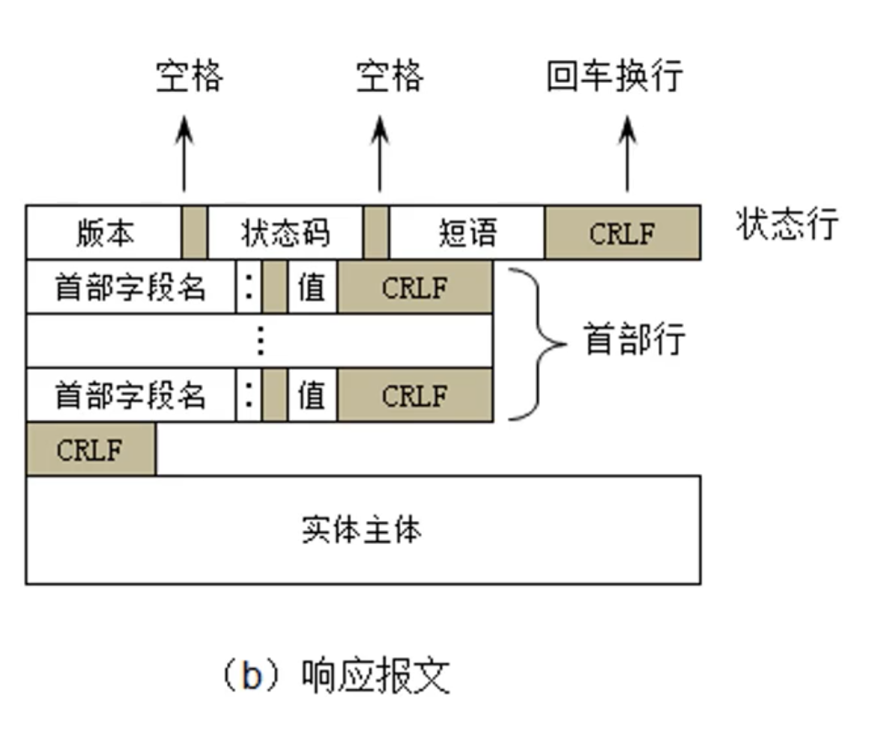

## 整体

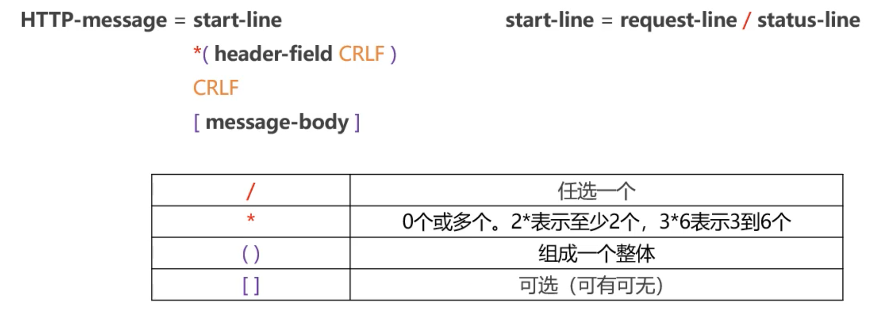

## request-line、status-line

## header-filed、message-body

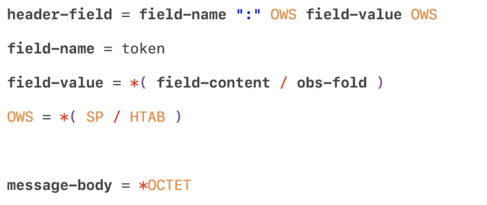

# URL的编码

- URL中一旦出现了一些特殊字符(比如中文、空格)，需要进行编码

	- 在浏览器地址栏输入URL时，是采用UTF-8进行编码

- 比如  

	- 编码前:https://www.baidu.com/s?wd=百度 

		编码后:https://www.baidu.com/s?wd=%E5%8D%8E%E4%B8%BA 

# 请求方法

- RFC 7231, section 4: Request methods：描述了8种请求方法
	- GET、HEAD、POST、PUT、DELETE、CONNECT、OPTIONS、TRACE

- RFC 5789, section 2: Patch method：描述了PATCH方法
- GET：常用于读取的操作，请求参数直接拼接在URL的后面(浏览器对URL是有长度限制的) 
- POST：常用于添加、修改、删除的操作，请求参数可以放到请求体中(没有大小限制)
- HEAD：请求得到与GET请求相同的响应，但没有响应体 
	- 使用场景举例：在下载一个大文件前，先获取其大小，再决定是否要下载。以此可以节约带宽资源

- OPTIONS：用于获取目的资源所支持的通信选项，比如服务器支持的请求方法 
	- OPTIONS * HTTP/1.1

- PUT：用于对已存在的资源进行整体覆盖
- PATCH：用于对资源进行部分修改(资源不存在，会创建新的资源)
- DELETE：用于删除指定的资源
- TRACE：请求服务器回显其收到的请求信息，主要用于HTTP请求的测试或诊断
- CONNECT：可以开启一个客户端与所请求资源之间的双向沟通的通道，它可以用来创建隧道(tunnel)
	- 可以用来访问采用了 SSL（HTTPS）协议的站点

# 头部字段（Header Field）

- 头部字段可以分为4种类型 
	- 请求头字段(Request Header Fields)  
		- 有关要获取的资源或客户端本身信息的消息头
	- 响应头字段(Response Header Fields) 
		- 有关响应的补充信息，比如服务器本身(名称和版本等)的消息头 
	- 实体头字段(Entity Header Fields) 
		- 有关实体主体的更多信息，比如主体长度(Content-Length)或其MIME类型 
	- 通用头字段(General Header Fields)
		- 同时适用于请求和响应信息，但与消息主题无关的消息头

## 请求头字段

- q 值越大，表示优先级越高
- 如果不指定 q 值，默认是 1.0 （1.0 是最大值）

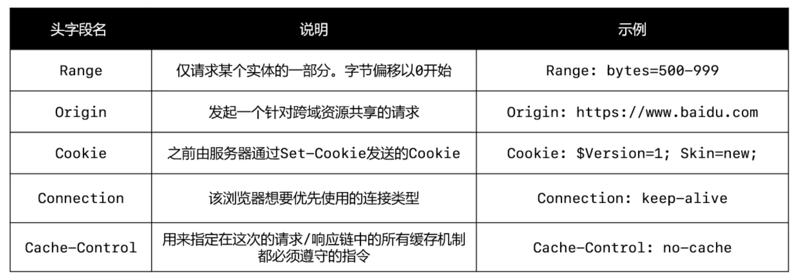

## 响应头字段

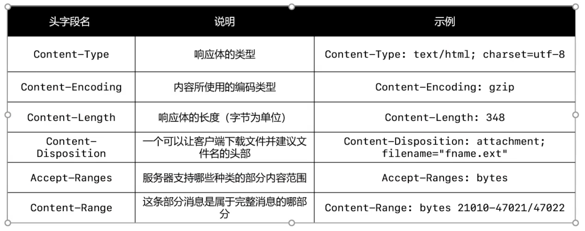

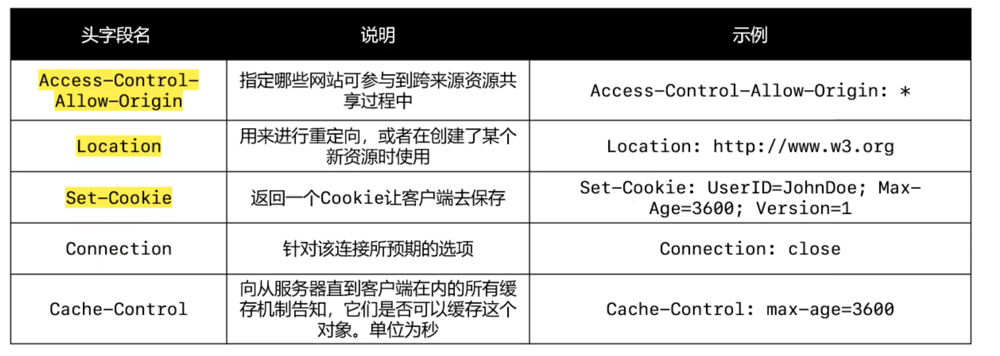

# 状态码（Status Code）

- 在 RFC 2616 10.Status Code Definitions 规范中定义
	- 状态码指示HTTP请求是否已成功完成
- 状态码可以分为5类
	- 信息响应：100 ~ 199 
	- 成功响应：200 ~ 299 
	- 重定向：300 ~ 399 
	- 客户端错误：400 ~ 499 
	- 服务器错误 ：500 ~ 599 

## 常见状态码

- 100 Continue 
	- 请求的初始部分已经被服务器收到，并且没有被服务器拒绝。客户端应该继续发送剩余的请求，如果请求已经完成，就忽略这个响应
	- 允许客户端发送带请求体的请求前，判断服务器是否愿意接收请求（服务器通过请求头判断）
	- 在某些情况下，如果服务器在不看请求体就拒绝请求时，客户端就发送请求体是不恰当的或低效的 
- 200 OK：请求成功  
- 302 Found：请求的资源被暂时的移动到了由Location头部指定的URL上 
- 304 Not Modified：说明无需再次传输请求的内容，也就是说可以使用缓存的内容 
- 400 Bad Request：由于语法无效，服务器无法理解该请求
- 401 Unauthorized：由于缺乏目标资源要求的身份验证凭证 
- 403 Forbidden：服务器端有能力处理该请求，但是拒绝授权访问
- 404 Not Found：服务器端无法找到所请求的资源
- 405 Method Not Allowed：服务器禁止了使用当前HTTP方法的请求 
- 406 Not Acceptable：服务器端无法提供与Accept-Charset以及Accept-Language指定的值相匹配的响应 
- 408 Request Timeout：服务器想要将没有在使用的连接关闭 
	- 一些服务器会在空闲连接上发送此信息，即便是在客户端没有发送任何请求的情况下 |
- 500 Internal Server Error：所请求的服务器遇到意外的情况并阻止其执行请求
- 501 Not Implemented：请求的方法不被服务器支持，因此无法被处理 
	- 服务器必须支持的方法(即不会返回这个状态码的方法)只有 GET 和 HEAD
- 502 Bad Gateway：作为网关或代理角色的服务器，从上游服务器(如tomcat)中接收到的响应是无效的 
- 503 Service Unavailable:服务器尚未处于可以接受请求的状态 
	- 通常造成这种情况的原因是由于服务器停机维护或者已超载 

# form表单提交

## 常用属性

- action:请求的URI 
-  method:请求方法(GET、POST) 
- enctype:POST请求时，请求体的编码方式
	- application/x-www-form-urlencoded(默认值)  
		- 用&分隔参数，用=分隔键和值，字符用URL编码方式进行编码 
	- multipart/form-data  
		- 文件上传时必须使用这种编码方式 

## multipart/form-data

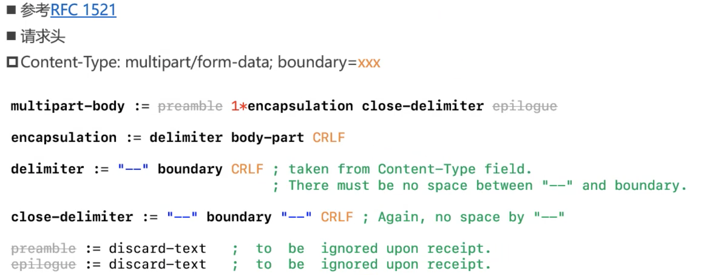

# CROS

## 同源策略

- 浏览器有个同源策略（Same-Origin Policy）
	- 它规定了：默认情况下，AJAX 请求只能发送给同源的 URL
	- 同源是指 3 个相同：协议、域名（IP）、端口

- img、script、link、iframe、video、audio 等标签不受同源策略的影响

## 跨域资源共享

- 解决 AJAX 跨跨域请求最常用的方法
	- CROS（Cross-Origin Resource Sharing），跨域资源共享
- CROS 的实现需要客户端和服务器同时支持
	- 客户端
		- 所有的浏览器都支持（ IE 至少是 IE 10 版本）
	- 服务器
		- 需要返回相应的相应头（比如Access-Control-Allow-Origin）
		- 告知浏览器这是一个允许跨域访问的请求

# 代理服务器（Proxy Server）

- 特点
	- 本身不产生内容
	- 处于中间位置转发上下游的请求和响应
		- 面向下游的客户端：它是服务器
		- 面向上游的服务器：它是客户端

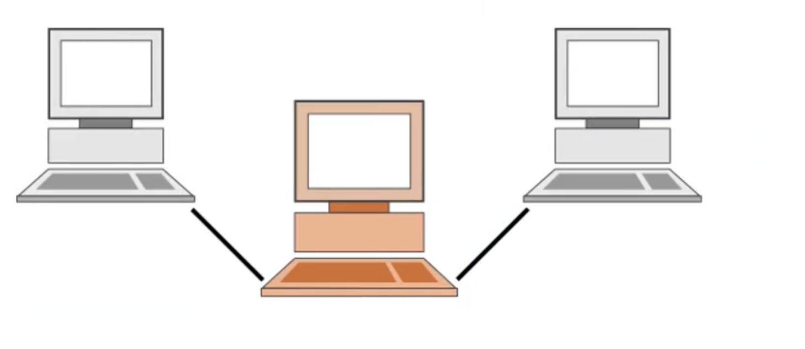

## 正向代理、反向代理

- 正向代理：代理的对象是客户端
- 反向代理：代理的对象是服务器

正向代理

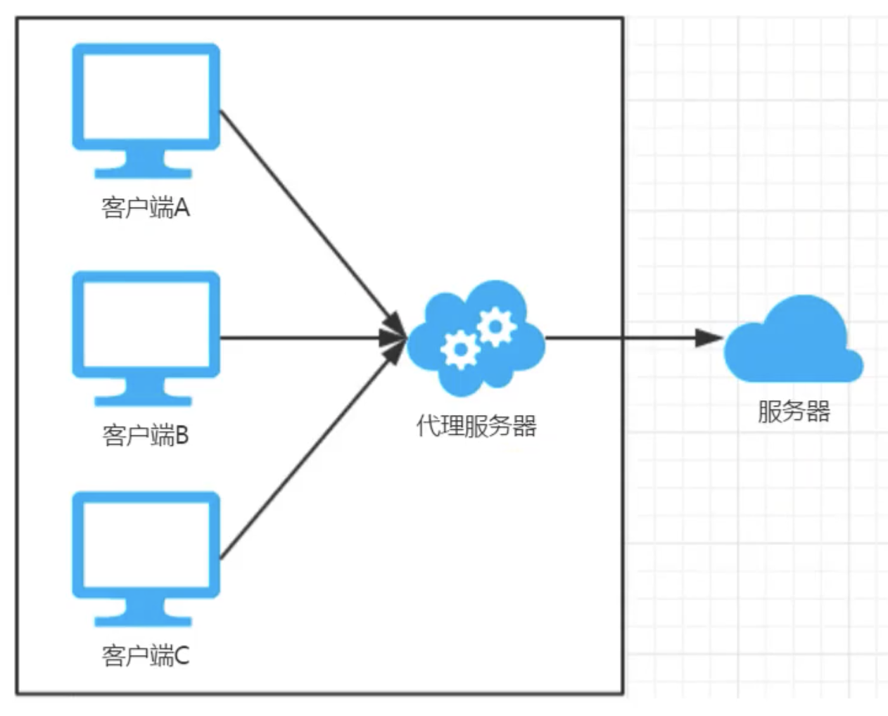

反向代理

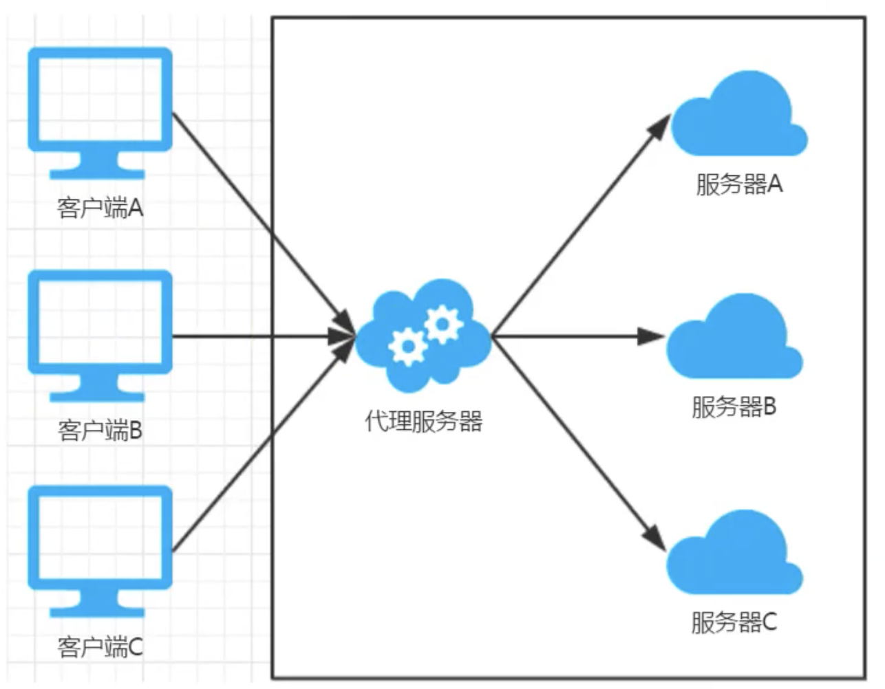

## 正向代理的作用

- 隐藏客户端身份

- 绕过防火墙（突破访问限制）

	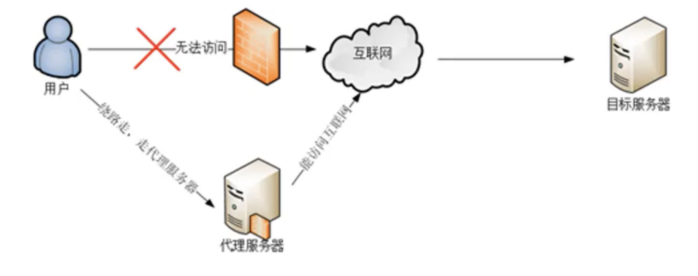

- Internet 访问控制

- 数据过滤

- 还有许多功能...

在互联网上还有许多免费的代理，可供我们使用

## 	反向代理的作用

- 隐藏服务器身份
- 安全防护
- 负载均衡

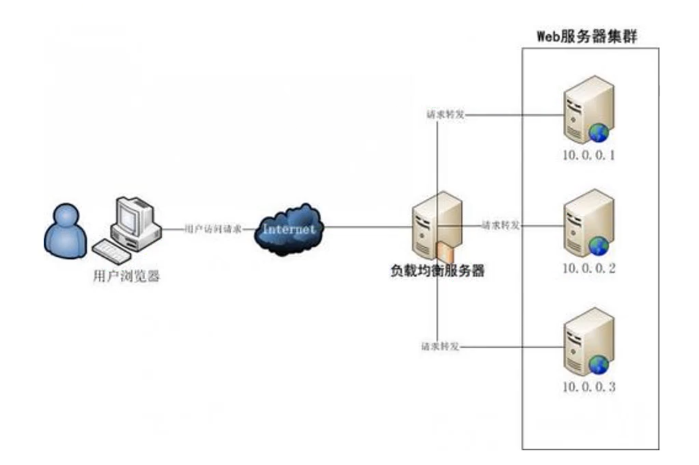

## 抓包工具的原理

- Fiddler、Charles 等抓包工具的原理：在客户端启动了正向代理服务

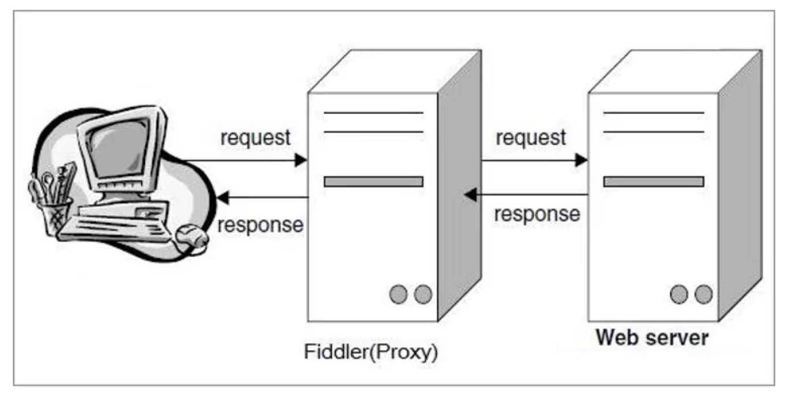

- 需要注意的是
	- Wireshark的原理是：通过底层驱动，拦截网卡上流过的数据

## 代理服务器相关的头部字段

# CDN

- CDN（Content Delivery Network 、Content Distribution Network），译为：内容分发网络

	- 利用最靠近每位用户的服务器
	- 更快更可靠的将音乐、图片、视频等资源文件（一般是静态资源）传递给用户

	

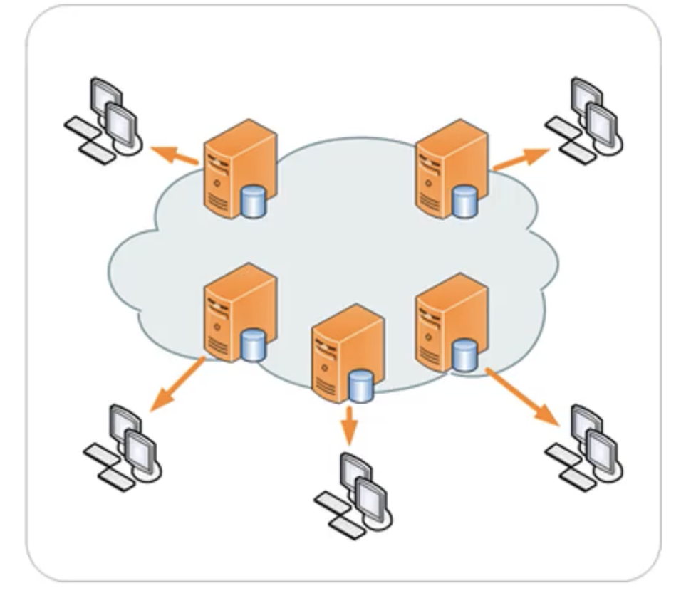

## 使用 CDN 前后

- CDN 运营商在全国、乃至全球的各大枢纽城市都建立了机房
	- 部署了大量拥有高储存高带宽的节点，构建了一个跨运营商，跨地域的专用网络
- 内容所有者向 CDN 运营商支付费用，CDN 将其内容交付给用户

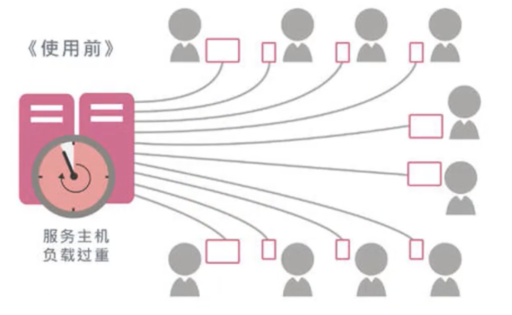

## 使用 CDN 前

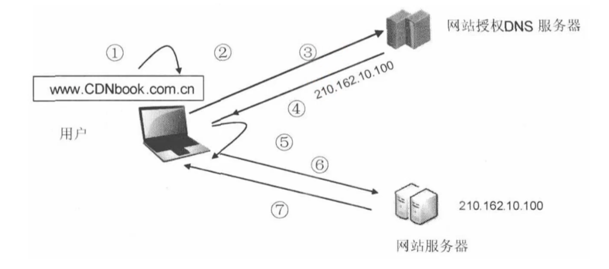

## 使用 CDN 后

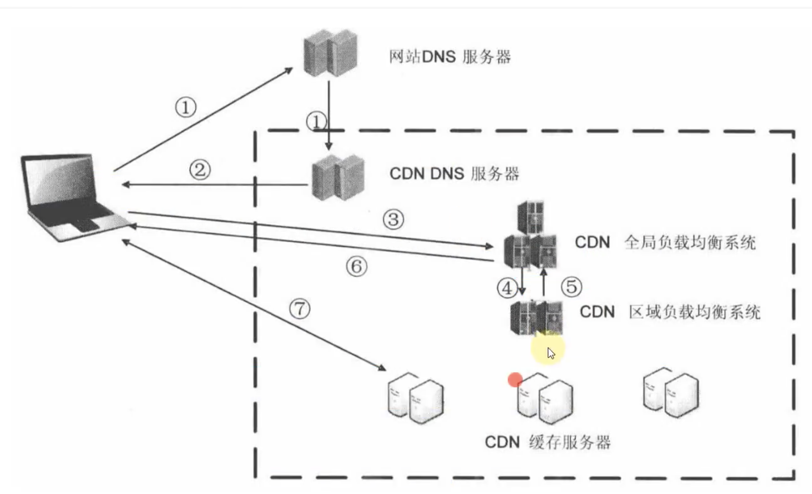

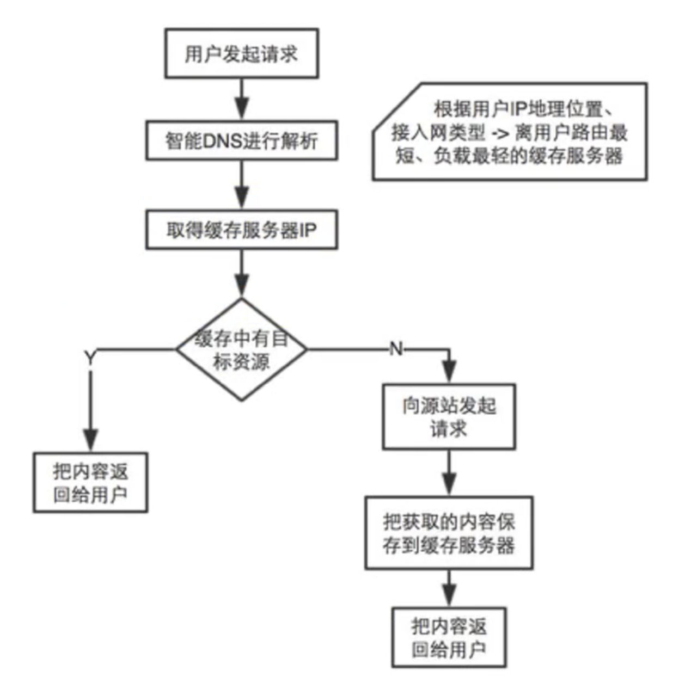

